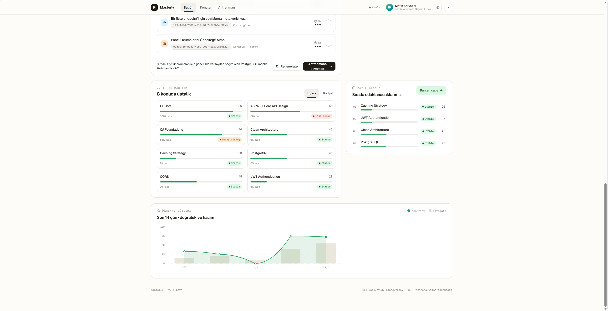
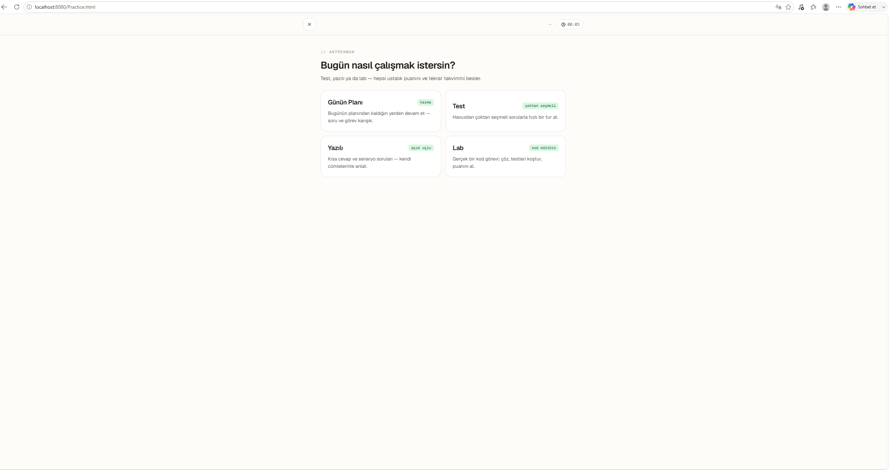
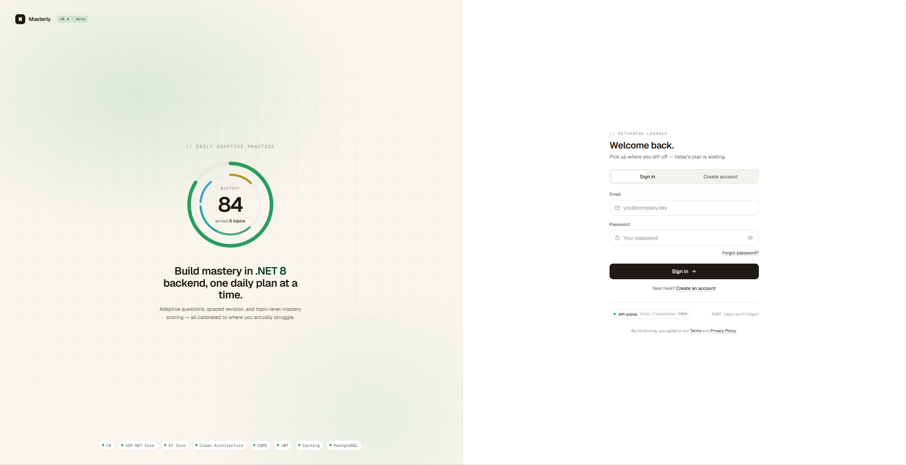
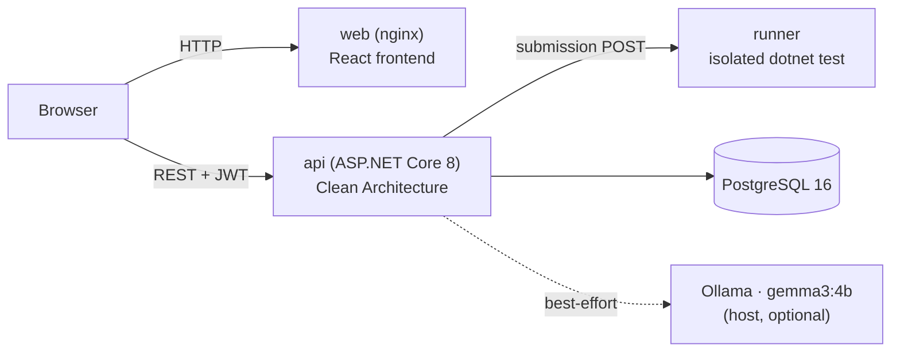

# CodeCraft.NET

**An adaptive training platform for .NET backend skills** — daily study plans drawn from a per-topic question pool, spaced-repetition-style revision, topic-level mastery scoring, and coding/scenario challenges judged by an isolated code runner. Clean-architecture ASP.NET Core 8 backend, React frontend.


 [](https://github.com/metinkaryagdi/Masterly/actions/workflows/ci.yml)

---

## Why this project

Most "practice platforms" show you a fixed question bank in a fixed order. CodeCraft.NET was built to solve the problem I actually had while training my own backend skills: figuring out **what to practice today**, given what I'm weak at, what I practiced recently, and what I already know cold — without a human curating the plan. It also had to grade real code, not just multiple choice, since that's the only way to actually validate backend skill.

---

## Screenshots

| Today's adaptive plan | Topic mastery & learning trend |
| --- | --- |
|  |  |

| Topic catalogue & prerequisite graph | Code judge |
| --- | --- |
|  |  |

| Practice modes | Landing & sign in |
| --- | --- |
|  |  |

> The UI is mostly Turkish, with some question content in English; full localisation is on the roadmap.

---

## Features

- **Onboarding** — pick goals, set a daily time budget, self-assess every topic (Novice / Familiar / Strong). Assessments seed initial mastery (20 / 45 / 70), so the very first plan is already personalized.
- **Question pool** — 8 curated questions per topic (64 total) across multiple choice, short answer, and scenario types, spread over three difficulty levels.
- **Adaptive daily plans** — each day's quota is drawn with weighted sampling: weak topics get 40%, recently-practiced 30%, strong 20%, new 10%. Selection round-robins across topics, targets the difficulty band matching current mastery, and holds back questions answered correctly in the last 7 days (spaced repetition). One coding and one scenario challenge round out the plan.
- **Per-topic decay model** — every topic tracks a **forgetting rate** and a resulting **decay risk**, surfaced as `Stable` / `Decay rising` / `High decay`. A topic you scored well on but haven't touched climbs back up the queue on its own, so the plan reacts to *when* you last practised, not just *how well*.
- **Topic prerequisite graph** — topics declare what they **build on** and what they **unlock** (e.g. ASP.NET Core API Design builds on C# Foundations and unlocks Caching Strategy, Clean Architecture and JWT Authentication), so weak fundamentals surface before the topics that depend on them.
- **Four practice modes** — continue today's mixed plan, a quick multiple-choice test, open-ended written questions, or a code lab. All of them feed the same mastery score and revision schedule.
- **Deterministic quiz evaluation** — option-match / accepted-answer-match / scenario keyword coverage updates mastery, streaks, and the revision schedule.
- **Code judge (HackerRank-style)** — coding challenges carry an xUnit test suite; a learner's submission is compiled together with that suite inside an **isolated runner container** and executed with `dotnet test`. The pass ratio becomes the score — all green is `Passed`, failures/compile errors come back as feedback. Scenario challenges are scored by evaluation-criteria coverage.
- **Analytics** — practice streak, average response time, task success rate, per-topic mastery, and a 14-day accuracy-vs-volume trend.
- **JWT auth**, per-user preferences, analytics dashboard.
- **Optional local AI feedback** — Ollama-backed coaching feedback (`gemma3:4b`) is appended to challenge submissions when enabled; everything works without it (best-effort, non-blocking).

## Architecture

Clean Architecture (4 layers) across 4 Dockerized services:

| Service | Role | Talks to |
| --- | --- | --- |
| **web** (nginx) | Static React frontend | Calls the API from the browser at `http://localhost:5000` |
| **api** (ASP.NET Core) | REST + Swagger, JWT auth, business logic | PostgreSQL and the runner, over the compose network |
| **runner** (ASP.NET Core) | Isolated code judge — no published port, resource-capped | Receives submissions via `POST http://runner:8080` from the API |
| **db** (PostgreSQL 16) | Persistence | — |


```mermaid
flowchart LR
    Browser["Browser"] -->|HTTP| Web["web (nginx)<br/>React frontend"]
    Browser -->|REST + JWT| Api["api (ASP.NET Core 8)<br/>Clean Architecture"]
    Api -->|submission POST| Runner["runner<br/>isolated dotnet test"]
    Api --> DB[("PostgreSQL 16")]
    Api -.best-effort.-> Ollama["Ollama · gemma3:4b<br/>(host, optional)"]
```

Layers: **Domain** (entities, enums, rules) → **Application** (CQRS handlers, validators, services) → **Infrastructure** (EF Core, auth, seeding, AI) → **Api** (controllers, middleware, composition root).

## Tech stack

| Layer | Technology |
| --- | --- |
| Backend | .NET 8 / ASP.NET Core 8, C# |
| Data access | EF Core 8.0.10, Npgsql 8.0.11 |
| Database | PostgreSQL 16 (alpine) |
| Auth | JWT (AspNetCore.Authentication.JwtBearer 8.0.10), ASP.NET Identity Core 8.0.10 |
| Validation / logging / docs | FluentValidation 11.11, Serilog 8.0.3, Swashbuckle/Swagger 6.6.2 |
| Testing | xUnit 2.9.3, Microsoft.NET.Test.Sdk 17.14.1 |
| Frontend | React, transpiled in the browser with Babel — no build or bundling step |
| AI | Ollama, `gemma3:4b` |

## By the numbers

- **64 questions** — 8 per topic × 8 topics, across MCQ / short-answer / scenario, 3 difficulty levels
- **~57 test methods** — 30 unit + 27 integration; integration tests run the real HTTP pipeline via `WebApplicationFactory` against in-memory Sqlite
- **9 REST controllers**, 2 EF Core migrations tracked
- **Runner limits:** 1536m memory, 1.5 CPUs, 512 pids, per-run timeout

## Running with Docker (recommended)

```bash
docker compose up -d --build
```

| Service | URL |
| --- | --- |
| Frontend (nginx) | <http://localhost:8080> |
| API + Swagger | <http://localhost:5000/swagger> |
| PostgreSQL | localhost:5432 (`postgres`/`postgres`) |
| Code runner | internal only — API reaches it at `http://runner:8080` |

Host ports can be overridden with `WEB_PORT`, `API_PORT`, `DB_PORT`. On startup the API applies EF Core migrations and tops up seed data (topics, question pool, challenges) idempotently.

First run: open `http://localhost:8080`, create an account, and walk through onboarding — dashboard, practice, topics, and challenge pages all work against the live API.

## Running locally without Docker

Requires the .NET 8 SDK and a reachable PostgreSQL (`docker compose up -d db` works fine).

```bash
dotnet run --project src/CodeCraftNet.Api        # API on http://localhost:5000
python -m http.server 8080 -d app                     # frontend
```

Each frontend page's Tweaks panel can flip `demoMode` on to browse with mock data and no backend.

## Tests

```bash
dotnet test tests/CodeCraftNet.UnitTests/CodeCraftNet.UnitTests.csproj
dotnet test tests/CodeCraftNet.IntegrationTests/CodeCraftNet.IntegrationTests.csproj
```

Integration tests boot the real pipeline via `WebApplicationFactory` against in-memory Sqlite — no database or Docker required. Both suites run on every push via [GitHub Actions](.github/workflows/ci.yml).

## Project layout

```
app/                                   # static frontend (React + Babel in-browser)
src/CodeCraftNet.Domain/           # entities, enums, domain rules
src/CodeCraftNet.Application/      # CQRS handlers, validators, services
src/CodeCraftNet.Infrastructure/   # EF Core, auth, seeding, migrations, AI
src/CodeCraftNet.Api/              # controllers, middleware, composition root
tests/                                 # xUnit unit + integration tests
docker/                                # nginx config, one-time SQL helpers
```

## Current status

Working end to end: onboarding, daily plans, quizzes, code judge, scenario challenges, JWT auth, analytics dashboard, settings — all running against the live API. Currently at **v0.4 beta**.

**Known limitations:**

- The frontend has no build pipeline — React is transpiled in the browser with Babel, which keeps setup trivial but rules out bundling, tree-shaking and production optimisation.
- Runner isolation is dev-grade — fine for a local learning tool, not hostile multi-tenant traffic.
- AI feedback is optional/best-effort by design.
- The UI is not localised yet; interface copy is Turkish while part of the question content is English.

## License

MIT — see [LICENSE](LICENSE).

---

*Built by [Metin Karyağdı](https://github.com/metinkaryagdi).*
